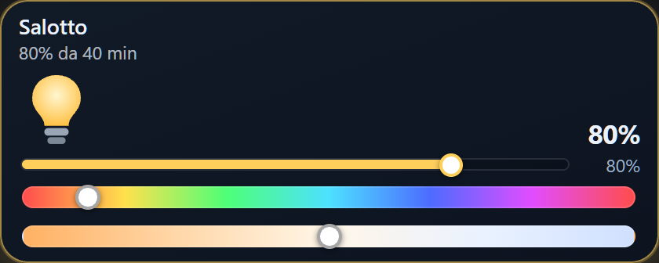
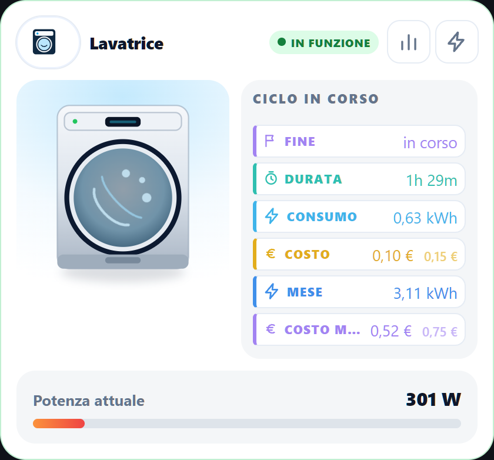
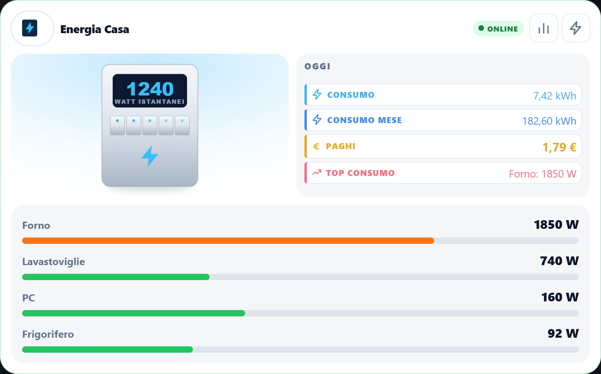
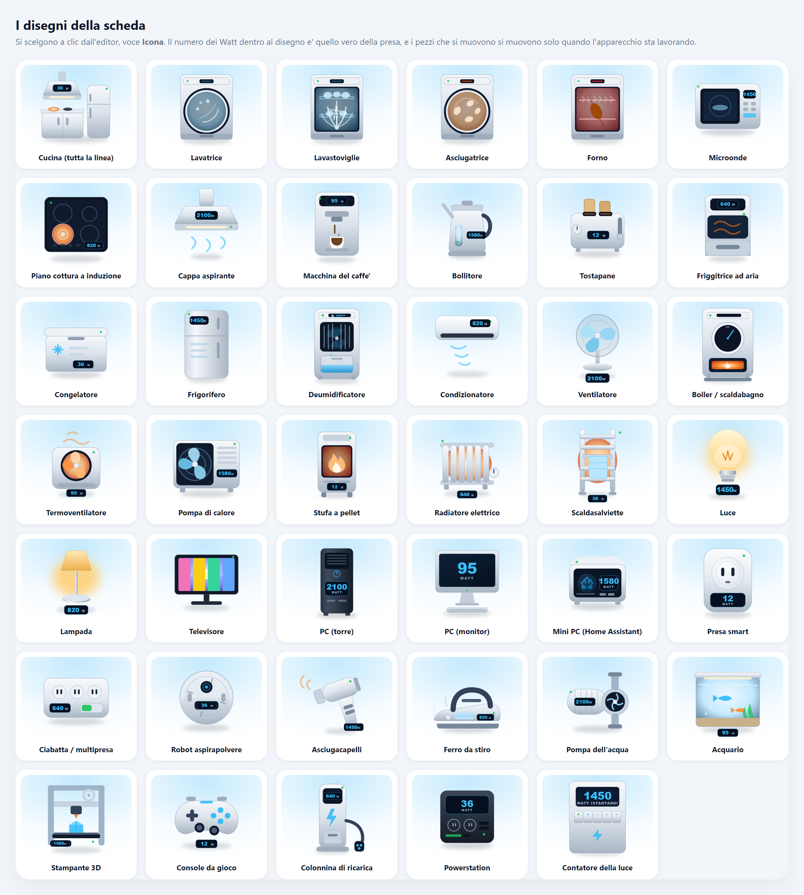

# Casa Tile Card

Three cards for Home Assistant, all **click-only** (no YAML): an animated tile for
any entity, plus two large cards for the **home's electricity** and for
**appliances**.

 

[🇮🇹 Italiano](README.md) · 🇬🇧 English

| | |
|---|---|
|  | **`custom:casa-tile`** — the tile. Animated icon, brightness bar, colour strip, "for how long". |
|  | **`custom:casa-elettrodomestico`** — an appliance or a socket: last cycle, energy and costs. |



**`custom:casa-energia`** — the home's electricity: watts right now, energy, costs,
what is using the most, and the circuit bars.

---

## Install

**With HACS**: HACS → top-right menu → *Custom repositories* →
`https://github.com/cash83/casa-tile-card`, category **Lovelace**. Then search for
**Casa Tile Card**, download it and reload the page (Ctrl+F5).

**By hand**: copy `dist/casa-tile-card.js` into `config/www/` and add it under
*Settings → Dashboards → Resources* as a **JavaScript Module**.

---

## The tile — `custom:casa-tile`

Add a card and look for **Casa · animated tile**.

**Icons.** 209 of them: 63 hand-drawn plus Home Assistant's own, with search in
Italian and English. The card picks one by looking at the entity; you can use your
own, a photo, or none at all. **They only move while the thing is on.**

**What it works out by itself.** Battery whose fill and colour follow the
percentage (and you can see whether it is charging or giving power) · weather with
the icon and the sky of the moment · colour that follows temperature · durations
written the way you'd say them (*1 h 30 min*) · live camera inside the tile.

**Controls.** Brightness and colour strip for lights · quick buttons for covers,
locks and vacuums · a slider for settable values · media controls with artwork,
a time wave, volume, speakers and **real multiroom** (remove the speaker in charge
and the queue moves to the others, with Music Assistant).

**Looks.** 19 lighting effects with strength and speed · two colours (one for the
effects, one for the text) · background as a tint, a photo or the weather sky ·
**trend chart** behind the text · **every piece where you want it**: name, value,
icon, bar and readings are dragged and resized inside a frame that is the card's
real size.

**People.** A ring coloured by where they are, for how long, and how far from home
— as the crow flies or by road.

**You decide when it is on**: always, at an exact value, above a threshold, or by
watching other entities.

**Your own dialog**: a tap opens a window where you put **any Home Assistant
card**, dressed however you like.

### The editor tabs

| Tab | What's in it |
|---|---|
| **Base** | entity, name, what is written, when the tile is on |
| **Icon** | which icon, entity picture, catalogue or your own image |
| **Looks** | layout, effects, colours, and "Where each piece goes" |
| **Background** | tint, transparency, photo, weather sky |
| **Controls** | slider, quick buttons, colour strip |
| **Chart** | trend, hours, area or line, min and max |
| **Media** | controls, artwork, speakers and sources |
| **People** | distance from home and the route sensor |
| **Tap** | what a tap does: toggle, details, dialog, map, service |

Tabs that don't apply to that entity disappear. At the top there is a **search**:
type "weather" and it tells you which tab holds each setting.

```yaml
type: custom:casa-tile
entity: light.living_room
```

---

## Energy and appliances

Two large cards, to put inside a tile's dialog or on their own on a dashboard.
They come from [Simonz82's cards](https://github.com/Simonz82/smart-home-cards),
brought inside casa-tile and extended.

### `custom:casa-energia` — the home's electricity

Watts now · energy and cost per period (hour, today, week, month, bill) ·
**energy only** and **+ taxes** · **what is using the most**, found by itself
among every metering socket, including the **"Unmetered"** share · **solar
savings** · circuit bars · the **bill broken down item by item**.

### `custom:casa-elettrodomestico` — an appliance or a socket

State (running, standby, off) · power bar · **last cycle**: end, duration, energy
and cost · energy and costs for today, this week and this month ·
**Statistics**: the periods, including **yesterday** and **last month**, plus the
last 7 days · **Energy**: charts for the last 24 hours, this month and this year ·
power buttons with names, one per socket · warnings (door open, overload).

**The cost shows two figures**: first **energy only**, then, set apart, what it
costs **on the bill**, everything included. The card finds the bill price by
itself — there is nothing to choose.

### The card creates the sensors

Nothing to prepare by hand: no YAML, no packages to copy.

**1. Your tariff, once for the whole home.** In `casa-energia`'s editor, the
**Your tariff** box: write the items as they appear on your bill — energy, grid
and charges, duties, VAT, daily standing charge — and press **Write the tariff**.
It works out the total per kWh. From then on every appliance finds the price
already selected.

**2. The counters.** The **Counters** box: choose which kWh sensor the home starts
from and press the button. It creates the counters for hour, today, week, month
and bill, plus the cost of each period with the standing charge counted over the
right days. In the same box you point at the **solar** sensor and the **battery**
one.

On appliances the button is called **Create statistics and costs** and does the
same in miniature: today's and this month's kWh, and if you tick **Follow the
cycles** also the "it is running" threshold, the cycle counter, the last-cycle
memories and the automation that closes it. If the socket doesn't count kWh
(common with Tuya) it works them out from the watts; if it counts Wh it converts.

**What it creates is ordinary Home Assistant stuff**: you find it under *Settings
→ Devices & services → Helpers*, it goes into the backup, and if one day you drop
the card it keeps working. Pressing the buttons twice does no harm: whatever
exists is reused.

**To delete** there is **Delete this card's helpers**: it shows the list with a
checkbox for each one and only throws away what you tick. It never touches the
prices, and before deleting it notes the values: if you create them again, they
start from there instead of zero.

> **The name matters.** Home Assistant prefixes counters with the source device's
> name: ask for "Washer energy today" and you get
> `sensor.kitchen_socket_washer_energy_today`. With a different name the history is
> orphaned. The card notices and **renames it by itself** right afterwards.

### Resetting the counters

In the editor, the **Counters** box, there is **Reset the counters**. The card
creates the script it needs (`script.casa_tile_azzera`): it is **one for the whole
home** and receives the appliance's entities, so a new appliance works straight
away. It resets today, the week, the cycle and the last-cycle memories; it only
touches the month if you ask.

### The artwork

Forty-one drawings, all hand-made. Pick one by click in the editor, **Icon**
field. The watt number inside the drawing is the real one from the plug, and the
moving parts - the drum, the blades, the flame, the steam, the bubbles - move
**only while the appliance is working**. When the card is off the drawing turns
grey.



Besides the appliances there are drawings for **whole circuits**: *Kitchen (the
whole circuit)* for a clamp on the breaker panel, *Electricity meter* for the
main line.

### "Work it out for me"

In the editor, **Work out the appliance** box: give it any entity of the
appliance - the plug, the switch, the state - and press the button. The card
looks at **every other entity of the same device** and fills in what it finds.

What it looks for, and how:

| It fills | How it finds it |
|---|---|
| the plug that measures | an entity of the same device with `device_class: power` |
| the artwork | words in the name (`washer`, `oven`, `fridge`, `kitchen`...) |
| the power buttons | the device's `switch.` entities; the one with `usb` in the name goes to the second button |
| today's and this month's counters | if counters named after the appliance already exist |
| **Cycle running** | five names: `energia_ciclo`/`cycle_energy`, `tempo_trascorso`/`elapsed`, `tempo_residuo`/`remain`, `programma`/`program`/`course`, `fase`/`phase`/`run_state` |

It fills **Cycle running** only when it finds **at least two** of them: a single
field, picked by name similarity, would confuse more than help. Those five
sensors come from the appliance's own integration (an LG, a Bosch), not from the
plug: on a smart plug or a clamp they stay empty, and that is correct.

**What it does NOT touch**: the price, the reset script, the theme, the layout,
the pop-up window, and the rows you picked. Those do not come from the device -
you set them - so you can press the button on a finished card without redoing
anything.

### How to add them

In the tile's editor, the **Tap** tab → *Open the appliance card (it sets itself
up)* or *Open the home energy card*. The card fills itself in starting from the
tile's entity: it finds the metering socket, the right artwork from the name and
whichever sensors exist.

Or add it to the dashboard on its own, and in its editor press **Fill it in for
me** starting from any entity of the appliance.

---

## Useful keys

Almost everything is click-only; these only matter if you write the YAML by hand.

| Key | What it does |
|---|---|
| `righe` | which rows show in the box, and in what order |
| `nomi_righe` | a row's name (empty = the default one) |
| `prezzo_entita` | the price in €/kWh: usually the main card's one |
| `reset_script` | the "Reset the counters" script; if you have none the card creates it |
| `period_entities` | each period's counters (the button writes them) |
| `ciclo` | the last-cycle entities (the button writes them) |
| `warn_entities` | the warning banner: `{entity, on_state, label}` |
| `tasti` | the power buttons: `{entity, nome, icona}` |

---

## What's new

The diary of every version lives in the
[GitHub releases](https://github.com/cash83/casa-tile-card/releases), together
with the code.

## License

MIT
